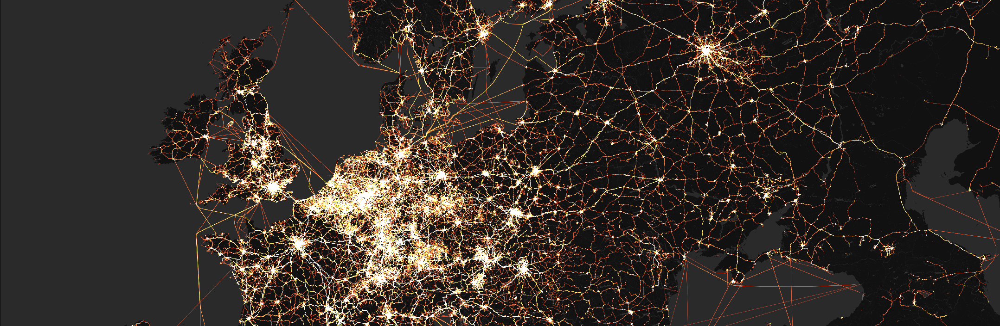

Hello, and welcome to my personal website! On these pages, I share primarily work-related content and news. I am currently an Assistant Professor of Geoinformation Technology at the [Department of Built Environment](https://www.aalto.fi/en/department-of-built-environment), Aalto University (Finland). 

### Research

At Aalto, I am a member of [Geoinformatics Research group](https://www.aalto.fi/en/department-of-built-environment/geoinformatics), and I lead the GIST Lab that advances research, teaching and open-source scientific software development around a variety of topics, such as:
- GIScience 
- Spatial accessibility and mobility analysis related to sustainable urban development and mobility 
- Understanding human activities in natural and urban environments based on user-generated content, such as social media data
- Sustainable use of water resources and the design of water resources policies
- Cypersecurity around open spatial data

### Software for advancing open science

I am part of the development team of the open source library `r5py` for multimodal spatial network analysis in Python; and I have created `pyrosm`, a small Python package to extract geospatial information from OpenStreetMap dump files. In addition, I have contributed to some of the core Python libraries for geospatial analysis and computation, such as `geopandas` and `osmnx`. 

### Teaching

I have authored and maintain a bunch of educational materials targeted for Python users including four openly available online courses and one text book. You can read more about these from [teaching -section.](https://htenkanen.org/teaching/)

### Contact

You can contact me via email at `henrikki.tenkanen [at] aalto.fi`. You can find me at Twitter as `@tenkahen`. 
