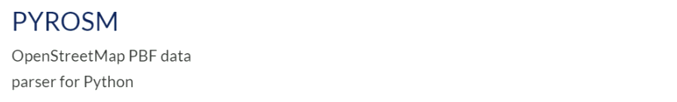

`pyrosm` is an open source Python library for reading OpenStreetMap from Protocolbuffer Binary Format -files (\*.osm.pbf) into Geopandas GeoDataFrames. Pyrosm makes it easy to extract various datasets from OpenStreetMap pbf-dumps including e.g. road networks, buildings, Points of Interest (POI), landuse, natural elements, administrative boundaries and much more. Fully customized queries are supported which makes it possible to parse any kind of data from OSM, even with more specific filters.

The library has been developed by keeping performance in mind, hence, it is mainly written in Cython (Python with C-like performance) which makes it probably faster than any other Python alternatives for parsing OpenStreetMap data. Pyrosm is built on top of another Cython library called Pyrobuf which is a faster Cython alternative to Google's Protobuf library: It provides 2-4x boost in performance for deserializing the protocol buffer messages compared to Google's version with C++ backend. Google's Protocol Buffers is a commonly used and efficient method to serialize and compress structured data which is also used by OpenStreetMap contributors to distribute the OSM data in PBF format (Protocolbuffer Binary Format).

### Documentation

You can read more about `pyrosm` from the [documentation](https://pyrosm.readthedocs.io/en/latest/) of the library.

### My role

I am the creator and maintainer of the library. If you're interested in helping out, do not hesitate to contact via [Github](https://github.com/HTenkanen/pyrosm/issues/new/choose). 
