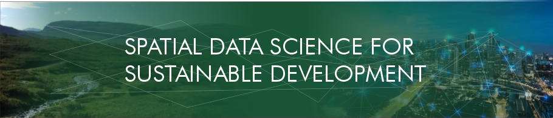
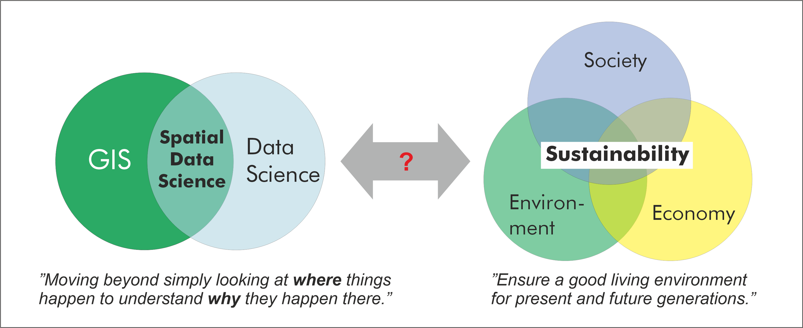

**Spatial data science for sustainable development** -course introduces geographical and computational analysis approaches to study sustainability related questions. The course is inspired by the United Nation’s 2030 Agenda for Sustainable Development and the Global Sustainable Development Report, as well as numerous scientific articles that have investigated sustainability related problems through the lense of geospatial analytics. 

### Learning goals

After completing this course, you should:

- understand and deepen your knowledge of a range of modern spatial data science (SDS) techniques and methodologies
- be able to apply SDS methodologies in practice to a range of sustainability/global change related topics with Python programming language
- have skills and understanding how to retrieve, handle and analyze modern big geospatial data in different formats.

### The course materials are openly available online

All materials are openly available online, see [http://sustainability-gis.readthedocs.org/](http://sustainability-gis.readthedocs.org)

