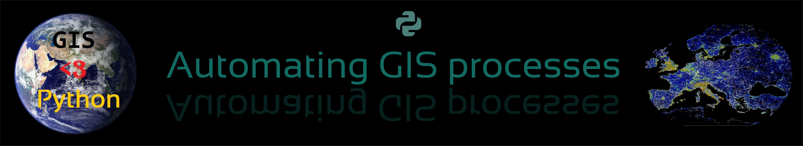

**Automating GIS-processes** -course at the University of Helsinki introduces you to geographic data processing and analysis in the Python programming language through interactive lessons and hands-on exercises.

### Learning goals

After completing this course, the students:

- can manage, analyze and visualize spatial data systematically and efficiently using Python
- can critically evaluate the available methods. 
- have geographic data manipulation and analysis skills 
- learn good programming practices, including the use of a version control system (git) and documenting and communicating their analysis workflow in online repositories (GitHub).

### The course materials are openly available online

All materials are openly available online, see [https://autogis-site.readthedocs.io/](https://autogis-site.readthedocs.io/)

### My contributions to the course

I created, maintained and taught the course during my PhD studies at the University of Helsinki between 2015-2018. 
Since then, I have still been involved in improving and maintaining the materials. The course continues to be taught at the University of Helsinki.
