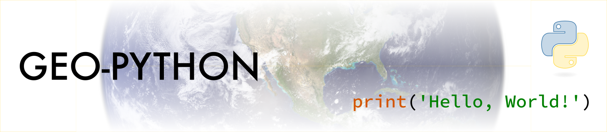

**Geo-Python** -course at the University of Helsinki teaches you the basic concepts of programming and scientific data analysis using the Python programming language in a format that is easy to learn and understand (no previous programming experience required). 
Each lesson is a tutorial with specific topic(s) where the aim is to gain skills and understanding how to solve common data-related tasks using Python. 

### Learning goals

After completing this course, the students:

- understand basic programming concepts, 
- are able to write short programs, 
- can manage, analyze and visualize scientific data using Python. 
- know how to use version control (git) and online repositories (GitHub) for documenting and communicating their work. 

### The course materials are openly available online

All materials are openly available online, see [https://geo-python-site.readthedocs.io/](https://geo-python-site.readthedocs.io)

### My contributions to the course

I created, maintained and taught the course during my PhD studies at the University of Helsinki between 2015-2018 
together with David Whipp who is a professor at the Department of Geosciences and Geography (UH). 
Since then, I have still been involved in improving and maintaining the materials, and currently we are turning the course into a MOOC format that can be 
taken also by students that are not graduate students of University of Helsinki. The course continues to be taught at the University of Helsinki.
